# Content Machine Flowchart

## Purpose

This file is the dedicated canonical reference for the Content Machine Flowchart.

It is extracted and canonicalized from the existing Content Machine Target Capability Map. It describes target architecture and operational relationships between strategy, SEO planning, evidence, content production, governance, human gates, preview, release, analytics and monetization.

It is not a live implementation. It does not activate runtime, publishing, analytics, monetization or queue execution.

## Non-Acceptance / Non-Activation

- This document does not set Publish Readiness.
- This document does not create Operator Acceptance.
- This document does not activate Public Launch.
- This document does not approve monetization.
- This document does not activate Analytics, Search Console or User Feedback.
- This document does not implement Runtime.
- This document does not execute the Work Queue.
- This document does not publish articles.
- This document does not claim screenshots, browser review, accessibility testing or WCAG conformance.
- This document does not treat target capabilities as live implementation.
- Human Operator remains final acceptance authority.

## Status Overlay

| Status | Meaning |
| --- | --- |
| current / documented | Documented in the repository as an artifact, rule or current-state note; not automatically productive. |
| partially implemented | Partly present as artifact, validator or workflow, but not fully automated or live. |
| target capability | Target capability for later build-out; not live implementation. |
| blocked | Blocked by missing evidence, methodology, Human Operator decision or trust conflict. |
| human-controlled | May be activated only by later explicit Human Operator decision. |
| not live | Not connected, not activated and without real data. |
| not ready | No publish, launch or release readiness exists. |
| not accepted | No Operator Acceptance exists. |
| not approved | No monetization, legal or approval-like status exists. |
| not connected | Analytics, Search Console or email/feedback systems are not connected. |
| not collected | User feedback or real feedback data has not been collected. |
| not performed | Review, screenshot, browser or accessibility testing has not been performed. |
| not claimed | WCAG conformance or accessibility certification is not claimed. |

## Mermaid Flowchart

```mermaid
flowchart TD

  %% =========================
  %% NEW STATUS LEGEND
  %% =========================
  LEG0["Status Overlay"]
  LEG1["implemented_documented = im System dokumentiert / teilweise nutzbar"]
  LEG2["target_capability = Ziel-Capability, nicht automatisch live"]
  LEG3["partial = teilweise vorhanden"]
  LEG4["blocked = blockiert"]
  LEG5["human_controlled = nur Human Operator"]
  LEG6["not_live = nicht aktiviert / keine echten Daten"]

  LEG0 --> LEG1
  LEG0 --> LEG2
  LEG0 --> LEG3
  LEG0 --> LEG4
  LEG0 --> LEG5
  LEG0 --> LEG6

  %% =========================
  %% 0. PORTFOLIO
  %% =========================
  subgraph B["0. Content Portfolio & Strategy Engine"]
    B1["Brand & Trust Definition"]
    B2["Audience Pain Point Pool"]
    B3["Content Cluster Map"]
    B4["Risk & Monetization Classification"]
    B5{"MVP / Roadmap Priority Gate"}
    B6["Content Backlog"]
  end

  %% =========================
  %% NEW SEO ENGINE
  %% =========================
  subgraph K["1. SEO & Keyword Research Engine"]
    K1["Keyword Discovery<br/>Seed, Pain Point, Senioren, Angehörige, App/Gerät, Safety"]
    K2["Keyword Qualification<br/>Intent, Funnel, Suitability, Trust, Competition, Evidence"]
    K3["Keyword Cluster Map<br/>Hub, Supporting, FAQ, Glossary, Checklist, Safety, Product"]
    K4["Keyword-to-Content-Type Mapping"]
    K5{"SEO Opportunity Gate"}
    K6["SEO Brief Addendum<br/>Primary KW, Secondary KWs, Title, H1/H2, FAQ, Snippet, Links"]
    K7["Cannibalization / Refresh Queue<br/>target capability, not live"]
  end

  %% =========================
  %% TOPIC
  %% =========================
  subgraph S["2. Topic Intake & Content Type Decision"]
    S1["Topic Record"]
    S2{"Content Type Decision"}
    S3["How-to Guide"]
    S4["Checklist / Printable"]
    S5["Warning / Safety Article"]
    S6["Product / Service Comparison"]
    S7["Hub / Glossary / FAQ"]
  end

  %% =========================
  %% RESEARCH / EVIDENCE
  %% =========================
  subgraph R["3. Research & Evidence Engine"]
    R1["SERP Observation"]
    R2["Source Discovery"]
    R3["Source Pack"]
    R4["Claim Extraction"]
    R5["Claim Map"]
    R6{"Evidence Gate"}
    R7{"SERP Fit Gate"}
    R8["BLOCKED<br/>insufficient evidence / weak fit / unclear claims"]
  end

  %% =========================
  %% PRODUCT RISK
  %% =========================
  subgraph PR["Product / Commercial Risk Control"]
    PR1{"Product Methodology Gate"}
    PR2["Product Recommendation Methodology Required"]
    PR3["Commercial Conflict Review"]
    PR4["Affiliate Disclosure Required"]
    PR5["BLOCKED<br/>Commercial / Affiliate Risk"]
  end

  %% =========================
  %% BRIEF
  %% =========================
  subgraph CB["4. Content Brief Engine"]
    CB1["Content Brief"]
    CB2["Senior UX Plan"]
    CB3["SEO Plan"]
    CB4["Asset Plan"]
    CB5["Monetization Constraint Plan"]
    CB6{"Brief Approval Gate"}
  end

  %% =========================
  %% REVIEW
  %% =========================
  subgraph G["5. Review & Governance Engine"]
    G1["Evidence Review"]
    G2["Senior UX Review"]
    G3["Safety Language Review"]
    G4["SEO Review Checklist<br/>Intent, Metadata, Links, FAQ, Schema, Snippet, Cannibalization"]
    G5["Monetization Review"]
    G6["Accessibility Review"]
    G7["Final Source Metadata Review"]
    G8{"Hard Gates Complete?"}
    G9["Fix Patch"]
  end

  %% =========================
  %% OPERATOR
  %% =========================
  subgraph O["6. Human Operator Control"]
    O1["Operator Review Packet"]
    O2{"Human Operator Decision"}
    O3{"publish_candidate allowed?"}
    O4{"Operator Acceptance?"}
    O5["approved_for_publish<br/>human-controlled"]
    O6["not_publish_ready / continue internal review"]
  end

  %% =========================
  %% PUBLISHING
  %% =========================
  subgraph P["7. Publishing & Release Engine"]
    P1["Publish-ready Checklist"]
    P2{"public_launch_ready?"}
    P3["Static Build / Publishing Adapter"]
    P4["Article Page"]
    P5["Hub / Navigation Update"]
    P6["Printable Version / Checklist"]
    P7["Schema / Metadata / Canonical"]
    P8["Release Record"]
  end

  %% =========================
  %% ANALYTICS ACTIVATION
  %% =========================
  subgraph AA["8. Privacy, Analytics & Feedback Activation"]
    AA1{"Privacy / Analytics Activation Gate"}
    AA2{"Search Console Activation?"}
    AA3{"Feedback Activation?"}
    AA4["NOT LIVE<br/>until operator/privacy activation"]
  end

  %% =========================
  %% LEARNING
  %% =========================
  subgraph A["9. Analytics & SEO Learning Engine"]
    A1["Search Console Data<br/>impressions, clicks, CTR, queries, indexing"]
    A2["Performance Review<br/>14/30/60/90 days"]
    A3["New Query / FAQ Candidate"]
    A4["Refresh / Rewrite / Merge / Noindex Decision"]
  end

  %% =========================
  %% MONETIZATION
  %% =========================
  subgraph M["10. Trust-first Monetization Engine"]
    M1{"Monetization Risk Gate"}
    M2{"Trust Conflict?"}
    M3["No Monetization<br/>Trust wins"]
    M4{"monetization_approved?<br/>human-controlled"}
    M5["Controlled Monetization<br/>disclosed, measured, reviewed"]
  end

  %% =========================
  %% FLOW
  %% =========================
  B1 --> B2 --> B3 --> B4 --> B5 --> B6
  B6 --> K1 --> K2 --> K3 --> K4 --> K5
  K5 -- "no" --> B6
  K5 -- "yes" --> K6 --> S1

  S1 --> S2
  S2 --> S3 --> R1
  S2 --> S4 --> R1
  S2 --> S5 --> R1
  S2 --> S7 --> R1
  S2 --> S6 --> PR1

  PR1 -- "methodology missing" --> PR2 --> PR5
  PR1 -- "commercial risk unresolved" --> PR3 --> PR5
  PR1 -- "allowed for research only" --> R1

  R1 --> R2 --> R3 --> R4 --> R5 --> R6
  R6 -- "fail" --> R8
  R6 -- "pass" --> R7
  R7 -- "fail" --> B6
  R7 -- "pass" --> CB1

  CB1 --> CB2 --> CB3 --> CB4 --> CB5 --> CB6
  CB6 -- "fail" --> R1
  CB6 -- "pass" --> G1

  G1 --> G2 --> G3 --> G4 --> G5 --> G6 --> G7 --> G8
  G8 -- "fail" --> G9 --> CB1
  G8 -- "pass" --> O1

  O1 --> O2
  O2 -- "revision" --> G9
  O2 -- "continue internal review" --> O6
  O2 -- "publish candidate possible" --> O3
  O3 -- "no" --> O6
  O3 -- "yes" --> O4
  O4 -- "no" --> O6
  O4 -- "yes" --> O5

  O5 --> P1 --> P2
  P2 -- "no" --> O6
  P2 -- "yes" --> P3
  P3 --> P4
  P3 --> P5
  P3 --> P6
  P3 --> P7
  P3 --> P8

  P3 --> AA1
  AA1 -- "not approved" --> AA4
  AA1 -- "approved" --> AA2
  AA1 -- "feedback review" --> AA3
  AA2 -- "active" --> A1
  AA3 -- "active" --> A2

  A1 --> A2 --> A3 --> B6
  A2 --> A4 --> K7 --> B6

  P3 --> M1 --> M2
  M2 -- "yes" --> M3
  M2 -- "no" --> M4
  M4 -- "no" --> M3
  M4 -- "yes" --> M5 --> A2

  %% =========================
  %% CURRENT STATE ANCHORS
  %% =========================
  CUR1["CURRENT: MVP_BATCH_01 = claim_slots_mapped"]
  CUR2["CURRENT: no Operator Acceptance"]
  CUR3["CURRENT: no Publish Readiness / no Public Launch"]
  CUR4["CURRENT: no Monetization / Affiliate Approval"]
  CUR5["CURRENT: no real Analytics / SEO / Ranking / Feedback data"]
  CUR6["CURRENT: Brief 002 Final Article Candidate but not_publish_ready"]
  CUR7["CURRENT: Brief 001 blocked by missing WhatsApp Line Evidence"]
  CUR8["CURRENT: Brief 004 blocked by Product Recommendation Methodology"]

  CUR1 -.-> R5
  CUR2 -.-> O4
  CUR3 -.-> P2
  CUR4 -.-> M4
  CUR5 -.-> AA4
  CUR6 -.-> G8
  CUR7 -.-> R8
  CUR8 -.-> PR5

  %% =========================
  %% STYLES
  %% =========================
  classDef target fill:#d5f5d5,stroke:#2e7d32,stroke-width:1px,color:#111;
  classDef partial fill:#fff3cd,stroke:#b7791f,stroke-width:1px,color:#111;
  classDef blocked fill:#f8d7da,stroke:#b91c1c,stroke-width:1px,color:#111;
  classDef human fill:#fde68a,stroke:#92400e,stroke-width:2px,color:#111;
  classDef notlive fill:#e5e7eb,stroke:#6b7280,stroke-width:1px,color:#111;
  classDef learning fill:#dbeafe,stroke:#1d4ed8,stroke-width:1px,color:#111;

  class B1,B2,B3,B4,B5,B6,K1,K2,K3,K4,K5,K6,S1,S2,S3,S4,S5,S6,S7,CB1,CB2,CB3,CB4,CB5 target;
  class R1,R2,R3,R4,R5,R6,R7,G1,G2,G3,G4,G5,G6,G7,G8 partial;
  class R8,PR5,M3,CUR1,CUR3,CUR4,CUR5,CUR6,CUR7,CUR8 blocked;
  class O1,O2,O3,O4,O5,M4 human;
  class AA1,AA2,AA3,AA4,A1,A2,A3,A4,K7 notlive;
  class LEG0,LEG1,LEG2,LEG3,LEG4,LEG5,LEG6 notlive;
```

## Current-State Anchors

| Anchor | Status Class | Meaning | Operational Implication |
| ------ | ------------ | ------- | ----------------------- |
| `MVP_BATCH_01 = claim_slots_mapped` | current / documented | Batch status remains claim-slot mapping, not article completion. | Continue through evidence, review and Human Gates before any publish path. |
| no Operator Acceptance | human-controlled / blocked | No project or article acceptance exists. | Prepare decision packets only; do not simulate acceptance. |
| no Publish Readiness / no Public Launch | not ready / blocked | No public release state exists. | Keep all artifacts internal unless later Human Operator launch path exists. |
| no Monetization / Affiliate Approval | not approved / human-controlled | No monetization approval or affiliate approval exists. | Keep product and commercial content blocked or planning-only. |
| no real Analytics / SEO / Ranking / Feedback data | not live / not connected / not collected | No real external performance or feedback source is connected. | Do not claim metrics, rankings, CTR, traffic, conversion, revenue or feedback. |
| Brief 002 Final Article Candidate but not_publish_ready | partially implemented / blocked | A final article candidate exists, but remains internal and not accepted. | Any publish-candidate path needs later Human Operator decision. |
| Brief 001 blocked by missing WhatsApp Line Evidence | blocked | Missing line-level evidence blocks draft progress. | Do not add WhatsApp UI-sensitive instructions or unlock blocked claims. |
| Brief 004 blocked by Product Recommendation Methodology | blocked | Product/commercial methodology is missing. | Do not add product recommendations, affiliate logic or monetization. |
| Static Preview Skeleton internal_only / not_public | partially implemented / internal_only | Internal HTML/CSS-only skeleton exists for review. | Treat as review artifact only, not public page or runtime. |
| Screenshot review not performed | not performed | Manual screenshot review is only planned by checklist. | Do not claim screenshots or screenshot review evidence. |
| Accessibility testing not performed | not performed | Static preview accessibility testing has not been performed. | Do not claim testing, certification or conformance. |
| WCAG conformance not claimed | not claimed | No WCAG conformance claim exists. | Keep all accessibility language as planning/review-only unless later evidence exists. |
| Runner runtime not implemented | specification_only_not_implemented / not live | Runner and next-task generator are specs only. | Keep runner work inspect/validate/propose/report only until Human Operator approval. |

## Flowchart Node to Pipeline Stage Mapping

| Flowchart Layer / Node | Pipeline Stage(s) | Pipeline Artifact(s) | Current Status | Human Gate Required | Forbidden Interpretation |
| ---------------------- | ----------------- | -------------------- | -------------- | ------------------- | ------------------------ |
| Strategy / Portfolio Engine | `STAGE_00_STRATEGY_TRUST_PORTFOLIO_INTAKE` | `docs/operations/content_pipeline/CONTENT_PIPELINE_CONTRACT_V1.md`; roadmap; dashboard | partially implemented | yes for strategic acceptance | Strategy notes are not market validation or launch approval. |
| SEO & Keyword Research Engine | `STAGE_02_KEYWORD_QUALIFICATION`; conceptually Stage 15 refresh loop later | SEO seed, qualification and cluster planning artifacts | target capability / not live | yes for production use or real-data activation | SEO planning is not search volume, ranking, CTR, traffic or revenue evidence. |
| Topic Intake & Content Type Decision | `STAGE_01_TOPIC_INTAKE` | backlog, briefs, scaffolds, dashboard | partially implemented | optional; required for disputed scope | Topic classification is not article publication. |
| Research & Evidence Engine | `STAGE_03_SOURCE_DISCOVERY_EVIDENCE_GATE`; `STAGE_04_CLAIM_EXTRACTION_CLAIM_MAPPING` | source packs, evidence capture, claim map | partially implemented | yes for blocked claim unlock or high-risk elevation | Evidence planning does not unlock blocked claims automatically. |
| Product / Commercial Risk Control | `STAGE_16_MONETIZATION_METHODOLOGY_TRUST_CONFLICT_GATE`; conceptually Stage 1/7 blockers | Trust policy; Work Queue CQ-V1-007 | blocked / human-controlled | yes | Product/commercial risk review is not monetization approval. |
| Content Brief Engine | `STAGE_05_CONTENT_BRIEF`; `STAGE_06_SEO_BRIEF_ADDENDUM` | briefs, SEO addenda, planning records | partially implemented | optional; required for disputed scope | Briefs and SEO addenda are not final article text. |
| Content Production Engine | `STAGE_07_DRAFT_SCAFFOLD`; `STAGE_08_ARTICLE_CANDIDATE` | draft scaffolds, article candidate, final candidate | partially implemented | yes before publish-candidate path | Article candidates are not publish-ready or accepted. |
| Review & Governance Engine | `STAGE_09_QUALITY_READER_ACCESSIBILITY_SAFETY_REVIEWS` | scorecards, reviews, source metadata review, static preview reviews | partially implemented | yes for acceptance-like outcome | Reviews and scorecards are not Operator Acceptance. |
| Human Operator Control | `STAGE_10_HUMAN_OPERATOR_REVIEW_PACKET`; `STAGE_11_PUBLISH_CANDIDATE_DECISION`; `STAGE_13_PUBLIC_LAUNCH_DECISION` | operator packets and decision records | human-controlled | yes | Codex may document explicit decisions but must not simulate them. |
| Publishing & Release Engine | `STAGE_12_WEBSITE_PREVIEW_RELEASE_PREPARATION`; `STAGE_13_PUBLIC_LAUNCH_DECISION` | website preview docs; static preview skeleton; future release checklist | target capability / blocked | yes before launch | Internal preview is not public launch or publish readiness. |
| Privacy / Analytics & Feedback Activation | `STAGE_14_ANALYTICS_SEARCH_CONSOLE_FEEDBACK_INTAKE` | feedback protocol baseline; future privacy/operator activation records | not live / not connected / not collected | yes | No analytics, Search Console or feedback data exists. |
| Analytics & SEO Learning Engine | `STAGE_15_REFRESH_REWRITE_MERGE_EXPANSION_LOOP` | future validated data records; runner specs conceptually support reporting | not live | yes for real-data use and major decisions | Learning loop is not active without real validated data. |
| Trust-first Monetization Engine | `STAGE_16_MONETIZATION_METHODOLOGY_TRUST_CONFLICT_GATE` | trust policy; CQ-V1-007 | blocked / human-controlled | yes | Trust conflict review is not monetization approval. |
| Website Preview / Static Preview Layer | `STAGE_12_WEBSITE_PREVIEW_RELEASE_PREPARATION` | `docs/operations/website_preview/README.md`; `preview_static_internal/README.md` | partially implemented / internal_only | yes before expansion or launch | Static preview is not runtime, SSG, public URL or launch. |
| Visual / Screenshot / Accessibility Review Layer | mapped_by_concept_only to `STAGE_09_QUALITY_READER_ACCESSIBILITY_SAFETY_REVIEWS` and Stage 12 preview review | visual planning, source-level visual review, screenshot checklist | partially implemented / not_performed / not_claimed | yes for review outcomes | Planning/checklists are not screenshots, browser review, accessibility test or WCAG conformance. |
| Runner / Next Task Generator Layer | mapped_by_concept_only to `STAGE_15_REFRESH_REWRITE_MERGE_EXPANSION_LOOP`; supports all stages only as later tooling | runner spec; next task generator spec | specification_only_not_implemented / not live | yes before runtime | Runner specs are not executable queue runtime. |

## Flowchart Node to Work Queue / Operational Artifact Mapping

| Flowchart Layer / Node | Work Queue Item / Operational Artifact | Current Status | Gap | Recommended Next Step | Forbidden Scope |
| ---------------------- | -------------------------------------- | -------------- | --- | --------------------- | --------------- |
| Human Operator Control / Brief 002 publish path | `CQ-V1-002`: Brief 002 Publish-Candidate Decision Packet | pending_human_operator_gate | Decision packet not yet prepared for publish-candidate gate | Prepare decision packet only if Human Operator prioritizes it. | Do not set `publish_candidate`, `approved_for_publish` or Operator Acceptance. |
| Research & Evidence / Brief 003 scope | `CQ-V1-003`: Brief 003 Device/Version Scope Decision | pending_human_operator_decision | Device/version and screenshot evidence unresolved | Human Operator scope decision record before any article candidate. | Do not validate Android/iOS paths without evidence. |
| Website Preview / Static Preview | `CQ-V1-004`: Website IA / Internal Preview Structure | completed_internal_planning | Work Queue does not reflect later skeleton/review chain as separate items | Keep preview chain documented or add future queue mapping only. | Do not activate public launch or analytics. |
| Runner / Next Task Generator | `CQ-V1-005`: Pipeline Runner / Next Task Generator Specification | future_candidate; specification_only_not_implemented | No Runner Readiness Matrix yet | `RUNNER_READINESS_MATRIX_SPECIFICATION_ONLY_INTERNAL`. | Do not implement runtime or execute queue. |
| SEO & Keyword Research | `CQ-V1-006`: Keyword Validation Framework | planning_only | No real search volume, ranking or Search Console source | Planning-only keyword review. | Do not invent search volume, ranking, traffic or CTR. |
| Trust-first Monetization | `CQ-V1-007`: Monetization Methodology | blocked_until_human_operator_decision | Product recommendation methodology missing | Prepare methodology decision packet only. | Do not add affiliate logic, ads or monetization approval. |
| Website Preview / Static Preview Layer | Static Preview Skeleton Review Packet | reviewed_internal_only_not_accepted | Review is not acceptance or launch | Keep as internal review evidence. | Do not treat review packet as Operator Acceptance. |
| Human Operator Control / Static Preview | Human Operator Review Record | accepted_as_internal_review_artifact_only | Project-level acceptance still absent | Continue only with scoped internal follow-up. | Do not infer Publish Readiness or Public Launch. |
| Visual / Accessibility Planning | Visual + Accessibility Review Planning | prepared_internal_only | Planning only; review/testing not performed | Continue with read-only reviews only. | Do not claim accessibility test or WCAG conformance. |
| Visual / Senior UX Review | Source-Level Visual Review Packet | source_level_review_completed_not_visual_approval | Browser/screenshot review not performed | Manual screenshot review after capture. | Do not claim screenshot review or visual approval. |
| Screenshot Review | Manual Screenshot Review Checklist | prepared_internal_only; not_performed | Screenshot capture/review not performed | Manual screenshot review packet only after capture/review evidence exists. | Do not create or claim screenshots in planning documents. |

## Operationalization Interpretation

Safe operationalization sequence:

1. Manual / read-only operation.
2. Validator-assisted operation.
3. Codex-assisted planning only.
4. Runner candidate for inspect/validate/propose/report only.
5. Runtime only after explicit Human Operator decision.
6. Public Launch only after separate Gate sequence.
7. Analytics/Search Console/User Feedback only after privacy/operator activation.
8. Monetization only after methodology and Human Operator approval.

## Known Gaps

- no dedicated Runner Readiness Matrix yet
- no explicit Preview Review Chain Architecture Overlay yet
- no screenshot review packet after capture yet
- no live analytics/search console/user feedback
- no monetization methodology approval
- no public release checklist active
- no Operator Acceptance
- no Publish Readiness

## Recommended Next Step

`RUNNER_READINESS_MATRIX_SPECIFICATION_ONLY_INTERNAL`

Reason: After the Flowchart is canonicalized and mapped to stages/queue artifacts, the next safe operationalization step is to define which runner modes are safe as specification-only / not implemented: `inspect_only`, `validate_only`, `propose_next_task` and `blocked_report_only`.
