# Content Machine Target Capability Map

## Executive Summary

Dieses Dokument beschreibt die Zielarchitektur einer skalierbaren, evidence-first, trust-first und SEO-/keyword-getriebenen Content Machine fuer Senioren-Hilfe Online.

Das externe Flowchart-/Systemdesign-Review wird als Strategie-Input verwendet. Es beschreibt keine produktive Ist-Architektur und keine Live-Freigabe. Die Zielarchitektur soll spaeter helfen, Themen, Keywords, Quellen, Claims, Artikelkandidaten, Reviews, Human-Operator-Gates, Publishing und Lernschleifen reproduzierbar zu verbinden.

## Current-State Disclaimer

Aktueller konservativer Systemstand:

- `MVP_BATCH_01 = claim_slots_mapped`.
- Keine Operator Acceptance.
- Keine Publish Readiness.
- Kein Public Launch.
- Keine Monetization / Affiliate Approval.
- Keine rechtliche Freigabe.
- Keine echten Analytics / SEO / Ranking / Feedback data.
- Brief 002 hat einen Final Article Candidate, bleibt aber `not_publish_ready` und `not_accepted`.
- Brief 001 bleibt blocked by missing WhatsApp Line Evidence.
- Brief 003 hat nur ein Draft Scaffold, keinen Text Candidate.
- Brief 004 bleibt blocked by Product Recommendation Methodology.

Dieses Dokument aktiviert keine Runtime, keine Website, keinen Publish-Adapter, keine Search-Console-Verbindung, keine Analytics-Integration, keinen Feedback-Loop, keine Monetarisierung und keine Affiliate-Logik.

## Status Overlay

| Statusklasse | Bedeutung |
| --- | --- |
| `current / documented` | Im Repo als Artefakt oder Regel dokumentiert; nicht automatisch produktiv. |
| `partially implemented` | Teilweise als Artefakt, Validator oder Workflow vorhanden, aber nicht vollstaendig automatisiert oder live. |
| `target capability` | Ziel-Capability fuer spaetere Ausbaustufen; noch nicht live. |
| `blocked` | Durch fehlende Evidenz, Methodik, Human-Entscheidung oder Trust-Konflikt blockiert. |
| `human-controlled` | Nur durch spaetere explizite Human-Operator-Entscheidung aktivierbar. |
| `not live` | Nicht verbunden, nicht aktiviert, ohne echte Daten. |

## Target Capability Map

| Layer | Ziel-Capability | Aktueller Status | Primaere Guardrails |
| --- | --- | --- | --- |
| 0. Strategy, Trust & Portfolio Engine | Portfolio, Trust-Regeln, Zielgruppen, Roadmap und Risiko-Klassifikation steuern | partially implemented | Keine Monetarisierung ohne Trust-Gate und Human-Entscheidung |
| 1. SEO & Keyword Research Engine | Keywords entdecken, qualifizieren, clustern und in SEO-Brief-Addenda ueberfuehren | target capability / not live | Keine Keyword-Volumen, Rankings, CTR, Traffic oder Revenue erfinden |
| 2. Topic Intake & Content Type Decision | Themen in How-to, Checklist, Safety, FAQ, Hub oder Product/Service-Typen klassifizieren | partially implemented | Product/Service-Typen bleiben methodisch blockiert, solange Methodik fehlt |
| 3. Research & Evidence Engine | SERP-Observation, Source Pack, Claim Extraction, Claim Map, Evidence Gate und SERP Fit Gate | partially implemented | SEO-Potenzial darf fehlende Evidenz nie ueberstimmen |
| 4. Content Brief Engine | Brief, Senior UX Plan, SEO Plan, Asset Plan und Monetization Constraint Plan erzeugen | partially implemented | Kein Brief darf blockierte Claims freischalten |
| 5. Content Production Engine | Drafts, Artikelkandidaten, Checklisten und interne Source-/Claim-Marker erstellen | partially implemented | Keine Artikelveroeffentlichung und keine neuen Claims ohne Review |
| 6. Review & Governance Engine | Evidence, Safety, SEO, Accessibility, Source Metadata und Monetization Reviews koordinieren | partially implemented | Reviews sind keine Operator Acceptance und keine Publish Readiness |
| 7. Human Operator Control | Review Packets, Human Decisions, Acceptance und Publish-Candidate-Gates kontrollieren | human-controlled | Codex simuliert keine Operator Acceptance |
| 8. Publishing & Release Engine | Publish-ready Checklist, Static Build, Article Page, Hubs, Schema, Release Record | target capability / blocked | Kein Public Launch ohne spaetere Human-Entscheidung |
| 9. Analytics, Search Console & Learning Engine | Search Console, Performance Review, Query-Lernen, Refresh/Rewrite/Merge-Entscheidungen | not live | Keine echten Daten behaupten, solange keine validierte Quelle verbunden ist |
| 10. Trust-first Monetization Engine | Monetization Risk Gate, Trust Conflict Review, kontrollierte Freigabe | target capability / human-controlled | Monetarisierung darf Trust-Konflikte nie ueberstimmen |

## Target Architecture Layers

### 0. Strategy, Trust & Portfolio Engine

Ziel: Themenportfolio, Zielgruppen, Trust-Definition, Roadmap-Prioritaeten und Risiko-/Monetarisierungsklassen zusammenfuehren.

Aktueller Stand: Roadmap, Dashboard, Governance-Dokumente und Batch-Artefakte sind dokumentiert. Das System ist intern operations-ready, aber nicht public-launch-ready.

### 1. SEO & Keyword Research Engine

Ziel: Keyword Discovery, Keyword Qualification, Cluster Mapping, Keyword-to-Content-Type Mapping und SEO Brief Addendum.

Aktueller Stand: Ziel-Capability. Es gibt keine echten Keyword-Volumen, Rankings, CTR, Traffic- oder Revenue-Daten.

### 2. Topic Intake & Content Type Decision

Ziel: Themen als How-to Guide, Checklist, Warning/Safety Article, Product/Service Comparison, Hub, Glossary oder FAQ klassifizieren.

Aktueller Stand: Backlog, Briefs und Scaffolds existieren teilweise. Product/Service Comparison bleibt ohne Product Recommendation Methodology blockiert.

### 3. Research & Evidence Engine

Ziel: SERP Observation, Source Discovery, Source Pack, Claim Extraction, Claim Map, Evidence Gate und SERP Fit Gate verbinden.

Aktueller Stand: Source Pack, Claim Map und SERP Observation sind dokumentiert. Einzelne Claims bleiben blockiert, wenn Evidenz fehlt.

### 4. Content Brief Engine

Ziel: Content Briefs mit Senior UX Plan, SEO Plan, Asset Plan und Monetization Constraint Plan erzeugen.

Aktueller Stand: Draft Scaffolds und Brief-Artefakte existieren teilweise. SEO Brief Addenda sind Ziel-Capability.

### 5. Content Production Engine

Ziel: Artikelkandidaten mit Claim-/Source-Markern, seniorengerechter Sprache und internen Review-Hinweisen erstellen.

Aktueller Stand: Brief 002 hat einen Final Article Candidate, bleibt aber `not_publish_ready` und `not_accepted`.

### 6. Review & Governance Engine

Ziel: Evidence Review, Senior UX Review, Safety Language Review, SEO Review Checklist, Monetization Review, Accessibility Review und Final Source Metadata Review zusammenfuehren.

Aktueller Stand: Fuer Brief 002 existieren mehrere interne Reviews, aber keine Publish Readiness und keine Operator Acceptance.

### 7. Human Operator Control

Ziel: Human Operator Review Packets, Human Decisions, Publish-Candidate-Entscheidungen und Operator Acceptance kontrollieren.

Aktueller Stand: Human-Entscheidungen sind dokumentiert, aber keine Annahme und keine Veroeffentlichungsfreigabe.

### 8. Publishing & Release Engine

Ziel: Publish-ready Checklist, Static Build / Publishing Adapter, Article Page, Hub / Navigation Update, Printable Version, Schema / Metadata / Canonical und Release Record.

Aktueller Stand: Ziel-Capability. Keine Website, kein Publish-Adapter und kein Public Launch sind in diesem Patch aktiv.

### 9. Analytics, Search Console & Learning Engine

Ziel: Nach spaeterer Freigabe Search Console Data, Performance Reviews, neue Query-/FAQ-Kandidaten und Refresh-/Rewrite-/Merge-Entscheidungen nutzen.

Aktueller Stand: not live. Keine Search-Console-, Analytics-, Ranking-, Traffic-, CTR-, Conversion-, Revenue- oder Feedbackdaten existieren.

### 10. Trust-first Monetization Engine

Ziel: Monetization Risk Gate, Trust Conflict Review, Human-controlled Monetization Approval und kontrollierte, offengelegte Monetarisierung.

Aktueller Stand: blocked / target capability. Keine Monetarisierung und keine Affiliate-Freigabe.

## Mermaid Flowchart

Dedicated canonical flowchart reference: `docs/architecture/CONTENT_MACHINE_FLOWCHART.md`.

This target capability map remains the broader explanatory architecture document. The dedicated flowchart file is for direct reference plus node-to-stage and node-to-queue mapping. This reference creates no status escalation, no runtime and no live implementation.

```mermaid
flowchart TD

  %% =========================
  %% NEW STATUS LEGEND
  %% =========================
  LEG0["Status Overlay"]
  LEG1["implemented_documented = im System dokumentiert / teilweise nutzbar"]
  LEG2["target_capability = Ziel-Capability, nicht automatisch live"]
  LEG3["partial = teilweise vorhanden"]
  LEG4["blocked = blockiert"]
  LEG5["human_controlled = nur Human Operator"]
  LEG6["not_live = nicht aktiviert / keine echten Daten"]

  LEG0 --> LEG1
  LEG0 --> LEG2
  LEG0 --> LEG3
  LEG0 --> LEG4
  LEG0 --> LEG5
  LEG0 --> LEG6

  %% =========================
  %% 0. PORTFOLIO
  %% =========================
  subgraph B["0. Content Portfolio & Strategy Engine"]
    B1["Brand & Trust Definition"]
    B2["Audience Pain Point Pool"]
    B3["Content Cluster Map"]
    B4["Risk & Monetization Classification"]
    B5{"MVP / Roadmap Priority Gate"}
    B6["Content Backlog"]
  end

  %% =========================
  %% NEW SEO ENGINE
  %% =========================
  subgraph K["1. SEO & Keyword Research Engine"]
    K1["Keyword Discovery<br/>Seed, Pain Point, Senioren, Angehörige, App/Gerät, Safety"]
    K2["Keyword Qualification<br/>Intent, Funnel, Suitability, Trust, Competition, Evidence"]
    K3["Keyword Cluster Map<br/>Hub, Supporting, FAQ, Glossary, Checklist, Safety, Product"]
    K4["Keyword-to-Content-Type Mapping"]
    K5{"SEO Opportunity Gate"}
    K6["SEO Brief Addendum<br/>Primary KW, Secondary KWs, Title, H1/H2, FAQ, Snippet, Links"]
    K7["Cannibalization / Refresh Queue<br/>target capability, not live"]
  end

  %% =========================
  %% TOPIC
  %% =========================
  subgraph S["2. Topic Intake & Content Type Decision"]
    S1["Topic Record"]
    S2{"Content Type Decision"}
    S3["How-to Guide"]
    S4["Checklist / Printable"]
    S5["Warning / Safety Article"]
    S6["Product / Service Comparison"]
    S7["Hub / Glossary / FAQ"]
  end

  %% =========================
  %% RESEARCH / EVIDENCE
  %% =========================
  subgraph R["3. Research & Evidence Engine"]
    R1["SERP Observation"]
    R2["Source Discovery"]
    R3["Source Pack"]
    R4["Claim Extraction"]
    R5["Claim Map"]
    R6{"Evidence Gate"}
    R7{"SERP Fit Gate"}
    R8["BLOCKED<br/>insufficient evidence / weak fit / unclear claims"]
  end

  %% =========================
  %% PRODUCT RISK
  %% =========================
  subgraph PR["Product / Commercial Risk Control"]
    PR1{"Product Methodology Gate"}
    PR2["Product Recommendation Methodology Required"]
    PR3["Commercial Conflict Review"]
    PR4["Affiliate Disclosure Required"]
    PR5["BLOCKED<br/>Commercial / Affiliate Risk"]
  end

  %% =========================
  %% BRIEF
  %% =========================
  subgraph CB["4. Content Brief Engine"]
    CB1["Content Brief"]
    CB2["Senior UX Plan"]
    CB3["SEO Plan"]
    CB4["Asset Plan"]
    CB5["Monetization Constraint Plan"]
    CB6{"Brief Approval Gate"}
  end

  %% =========================
  %% REVIEW
  %% =========================
  subgraph G["5. Review & Governance Engine"]
    G1["Evidence Review"]
    G2["Senior UX Review"]
    G3["Safety Language Review"]
    G4["SEO Review Checklist<br/>Intent, Metadata, Links, FAQ, Schema, Snippet, Cannibalization"]
    G5["Monetization Review"]
    G6["Accessibility Review"]
    G7["Final Source Metadata Review"]
    G8{"Hard Gates Complete?"}
    G9["Fix Patch"]
  end

  %% =========================
  %% OPERATOR
  %% =========================
  subgraph O["6. Human Operator Control"]
    O1["Operator Review Packet"]
    O2{"Human Operator Decision"}
    O3{"publish_candidate allowed?"}
    O4{"Operator Acceptance?"}
    O5["approved_for_publish<br/>human-controlled"]
    O6["not_publish_ready / continue internal review"]
  end

  %% =========================
  %% PUBLISHING
  %% =========================
  subgraph P["7. Publishing & Release Engine"]
    P1["Publish-ready Checklist"]
    P2{"public_launch_ready?"}
    P3["Static Build / Publishing Adapter"]
    P4["Article Page"]
    P5["Hub / Navigation Update"]
    P6["Printable Version / Checklist"]
    P7["Schema / Metadata / Canonical"]
    P8["Release Record"]
  end

  %% =========================
  %% ANALYTICS ACTIVATION
  %% =========================
  subgraph AA["8. Privacy, Analytics & Feedback Activation"]
    AA1{"Privacy / Analytics Activation Gate"}
    AA2{"Search Console Activation?"}
    AA3{"Feedback Activation?"}
    AA4["NOT LIVE<br/>until operator/privacy activation"]
  end

  %% =========================
  %% LEARNING
  %% =========================
  subgraph A["9. Analytics & SEO Learning Engine"]
    A1["Search Console Data<br/>impressions, clicks, CTR, queries, indexing"]
    A2["Performance Review<br/>14/30/60/90 days"]
    A3["New Query / FAQ Candidate"]
    A4["Refresh / Rewrite / Merge / Noindex Decision"]
  end

  %% =========================
  %% MONETIZATION
  %% =========================
  subgraph M["10. Trust-first Monetization Engine"]
    M1{"Monetization Risk Gate"}
    M2{"Trust Conflict?"}
    M3["No Monetization<br/>Trust wins"]
    M4{"monetization_approved?<br/>human-controlled"}
    M5["Controlled Monetization<br/>disclosed, measured, reviewed"]
  end

  %% =========================
  %% FLOW
  %% =========================
  B1 --> B2 --> B3 --> B4 --> B5 --> B6
  B6 --> K1 --> K2 --> K3 --> K4 --> K5
  K5 -- "no" --> B6
  K5 -- "yes" --> K6 --> S1

  S1 --> S2
  S2 --> S3 --> R1
  S2 --> S4 --> R1
  S2 --> S5 --> R1
  S2 --> S7 --> R1
  S2 --> S6 --> PR1

  PR1 -- "methodology missing" --> PR2 --> PR5
  PR1 -- "commercial risk unresolved" --> PR3 --> PR5
  PR1 -- "allowed for research only" --> R1

  R1 --> R2 --> R3 --> R4 --> R5 --> R6
  R6 -- "fail" --> R8
  R6 -- "pass" --> R7
  R7 -- "fail" --> B6
  R7 -- "pass" --> CB1

  CB1 --> CB2 --> CB3 --> CB4 --> CB5 --> CB6
  CB6 -- "fail" --> R1
  CB6 -- "pass" --> G1

  G1 --> G2 --> G3 --> G4 --> G5 --> G6 --> G7 --> G8
  G8 -- "fail" --> G9 --> CB1
  G8 -- "pass" --> O1

  O1 --> O2
  O2 -- "revision" --> G9
  O2 -- "continue internal review" --> O6
  O2 -- "publish candidate possible" --> O3
  O3 -- "no" --> O6
  O3 -- "yes" --> O4
  O4 -- "no" --> O6
  O4 -- "yes" --> O5

  O5 --> P1 --> P2
  P2 -- "no" --> O6
  P2 -- "yes" --> P3
  P3 --> P4
  P3 --> P5
  P3 --> P6
  P3 --> P7
  P3 --> P8

  P3 --> AA1
  AA1 -- "not approved" --> AA4
  AA1 -- "approved" --> AA2
  AA1 -- "feedback review" --> AA3
  AA2 -- "active" --> A1
  AA3 -- "active" --> A2

  A1 --> A2 --> A3 --> B6
  A2 --> A4 --> K7 --> B6

  P3 --> M1 --> M2
  M2 -- "yes" --> M3
  M2 -- "no" --> M4
  M4 -- "no" --> M3
  M4 -- "yes" --> M5 --> A2

  %% =========================
  %% CURRENT STATE ANCHORS
  %% =========================
  CUR1["CURRENT: MVP_BATCH_01 = claim_slots_mapped"]
  CUR2["CURRENT: no Operator Acceptance"]
  CUR3["CURRENT: no Publish Readiness / no Public Launch"]
  CUR4["CURRENT: no Monetization / Affiliate Approval"]
  CUR5["CURRENT: no real Analytics / SEO / Ranking / Feedback data"]
  CUR6["CURRENT: Brief 002 Final Article Candidate but not_publish_ready"]
  CUR7["CURRENT: Brief 001 blocked by missing WhatsApp Line Evidence"]
  CUR8["CURRENT: Brief 004 blocked by Product Recommendation Methodology"]

  CUR1 -.-> R5
  CUR2 -.-> O4
  CUR3 -.-> P2
  CUR4 -.-> M4
  CUR5 -.-> AA4
  CUR6 -.-> G8
  CUR7 -.-> R8
  CUR8 -.-> PR5

  %% =========================
  %% STYLES
  %% =========================
  classDef target fill:#d5f5d5,stroke:#2e7d32,stroke-width:1px,color:#111;
  classDef partial fill:#fff3cd,stroke:#b7791f,stroke-width:1px,color:#111;
  classDef blocked fill:#f8d7da,stroke:#b91c1c,stroke-width:1px,color:#111;
  classDef human fill:#fde68a,stroke:#92400e,stroke-width:2px,color:#111;
  classDef notlive fill:#e5e7eb,stroke:#6b7280,stroke-width:1px,color:#111;
  classDef learning fill:#dbeafe,stroke:#1d4ed8,stroke-width:1px,color:#111;

  class B1,B2,B3,B4,B5,B6,K1,K2,K3,K4,K5,K6,S1,S2,S3,S4,S5,S6,S7,CB1,CB2,CB3,CB4,CB5 target;
  class R1,R2,R3,R4,R5,R6,R7,G1,G2,G3,G4,G5,G6,G7,G8 partial;
  class R8,PR5,M3,CUR1,CUR3,CUR4,CUR5,CUR6,CUR7,CUR8 blocked;
  class O1,O2,O3,O4,O5,M4 human;
  class AA1,AA2,AA3,AA4,A1,A2,A3,A4,K7 notlive;
  class LEG0,LEG1,LEG2,LEG3,LEG4,LEG5,LEG6 notlive;
```

## Current-State Anchors

| Anchor | Statusklasse | Bedeutung |
| --- | --- | --- |
| `MVP_BATCH_01 = claim_slots_mapped` | current / documented | Batch ist intern dokumentiert, aber nicht publish-ready. |
| `no Operator Acceptance` | human-controlled / blocked | Keine Annahme durch Codex; nur Human Operator kann spaeter entscheiden. |
| `no Publish Readiness / no Public Launch` | blocked | Keine Veroeffentlichung oder Launch-Freigabe. |
| `no Monetization / Affiliate Approval` | blocked / human-controlled | Monetarisierung bleibt aus. |
| `no real Analytics / SEO / Ranking / Feedback data` | not live | Keine echten Datenquellen verbunden. |
| `Brief 002 not_publish_ready` | partially implemented / blocked | Final Article Candidate existiert, bleibt intern. |
| `Brief 001 blocked by missing WhatsApp Line Evidence` | blocked | Fehlende Evidenz blockiert Draft-Fortschritt. |
| `Brief 004 blocked by Product Recommendation Methodology` | blocked | Product/Commercial-Risiko ohne Methodik blockiert. |

## Conservative Operating Rules

- SEO potential must never override missing evidence.
- Monetization potential must never override trust conflicts.
- LLMs must not claim legal approval.
- LLMs must not simulate Operator Acceptance.
- Blocked claims remain blocked unless evidence is added and reviewed.
- `publish_candidate`, `approved_for_publish`, Public Launch und Monetization Approval sind human-controlled.
- Search Console, Analytics und Feedback bleiben `not_live`, bis spaetere Datenschutz-/Operator-Gates dokumentiert und freigegeben sind.
